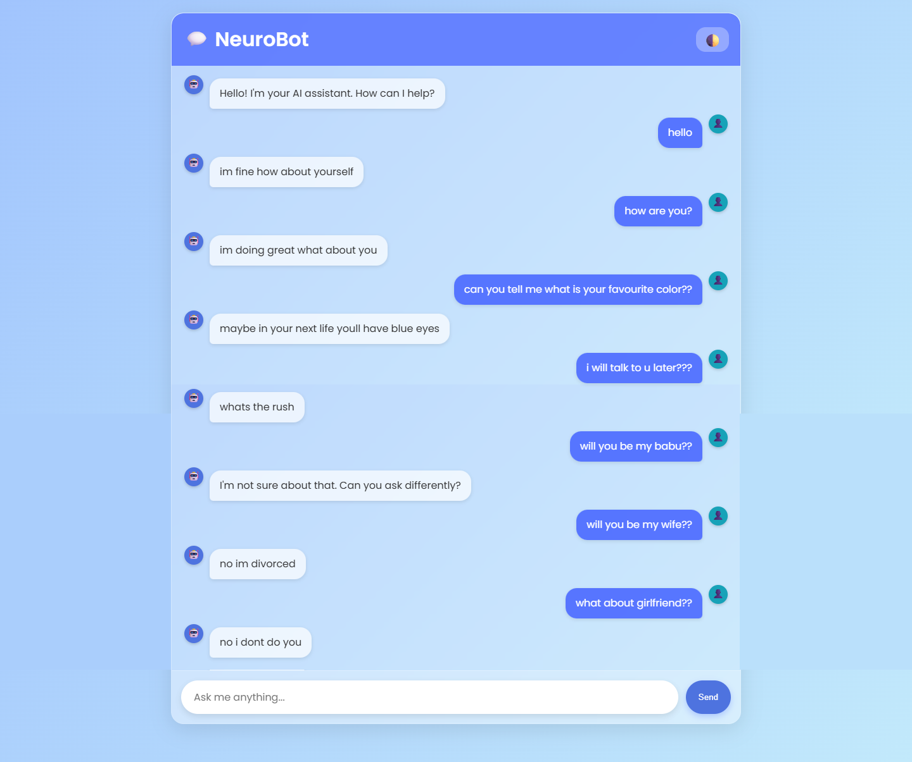

# 💬 NeuroBot - AI Chatbot with Modern UI

A sleek, responsive, and intelligent chatbot built with **FastAPI**, **Sentence Transformers**, and a **glassmorphic UI**.  
NeuroBot understands natural queries, replies with context, and features a stunning dark/light mode interface with smooth animations.

  


---

## 🔧 Features

✨ **Beautiful UI**  
- Glassmorphism design with blur effects  
- Dark/light mode toggle (persists user preference)  
- Smooth message animations and typing indicator  
- User & bot avatars (🤖 and 👤)

🧠 **Smart Responses**  
- Semantic matching using `all-MiniLM-L6-v2`  
- Precomputed sentiment-aware dataset  
- Cosine similarity for best response selection  
- Offensive word filtering

⚡ **Fast & Lightweight**  
- Built with **FastAPI** (async-ready)  
- No external database needed (CSV-powered)  
- Works offline after setup


## 📦 Project Structure
```
chatbot_app/
│
├── main.py # FastAPI backend
├── data.csv # Q&A dataset with sentiment
├── templates/
│ └── index.html # Frontend chat interface
└── static/
└── style.css # Modern responsive styling
```

---

## 🚀 How to Run

### 1. Clone the repo
```
git clone https://github.com/your-username/neurobot-chatbot.git
cd neurobot-chatbot
```
### 2. Install dependencies
```
pip install -r requirements.txt
```
### 3. Run the app
```
uvicorn main:app 
```
### REquirements
```
numpy==1.26.4
pandas==2.2.3
scikit-learn==1.2.2
sentence-transformers==4.1.0
nltk==3.9.1
fastapi==0.115.13
Jinja2==3.1.6
uvicorn==0.34.3
pydantic==2.11.7
python-multipart

```
```
pip install -r requirements.txt
```
🌟 Future Ideas
✅ Voice input (mic button)
💾 Save chat history to localStorage
📤 Export conversation as text
🤖 Add bot "thinking" time simulation
🔄 Teach the bot new responses


# 🚀 Chatbot App – Version 2: Smarter, Smoother, and More Beautiful
```
In this upgraded version, the chatbot has evolved from a basic console-based assistant into a fully interactive web experience with a modern, eye-catching UI. Key improvements include:
```

```
✅ Web Interface: No more terminal — now users chat in a sleek browser interface.
🎨 Unique Rounded Design: Ultra-smooth, glassmorphic chat bubbles with soft gradients and blur effects for a premium feel.
💬 Real-Time Teaching: Users can teach the bot new responses directly in the chat — no input prompts in the console.
🤖 Bot Avatars & Typing Indicator: Adds personality and realism with animated typing and avatars (🤖 / 👤).
🔁 Always Responds: Fixed logic to ensure the bot replies to every input — including "hi", offensive words, or unknown queries.
💾 Permanent Learning: New knowledge is saved to data.csv, so the bot remembers what it learns across restarts.
🌐 FastAPI-Powered Backend: Clean, scalable, and responsive — built for real-world use.
```